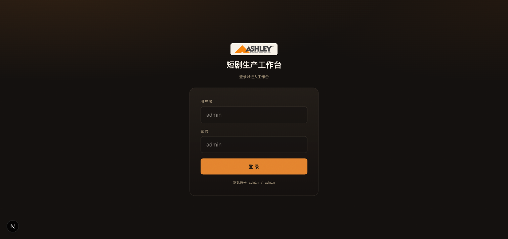
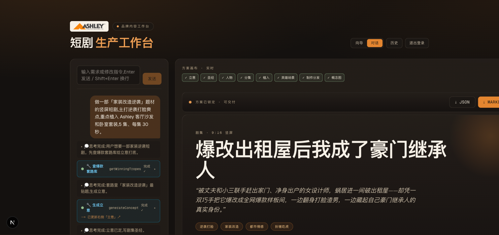
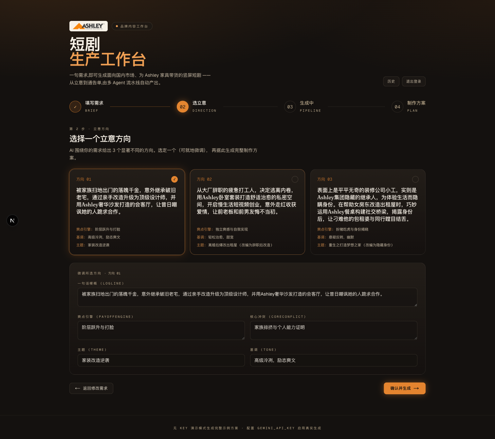
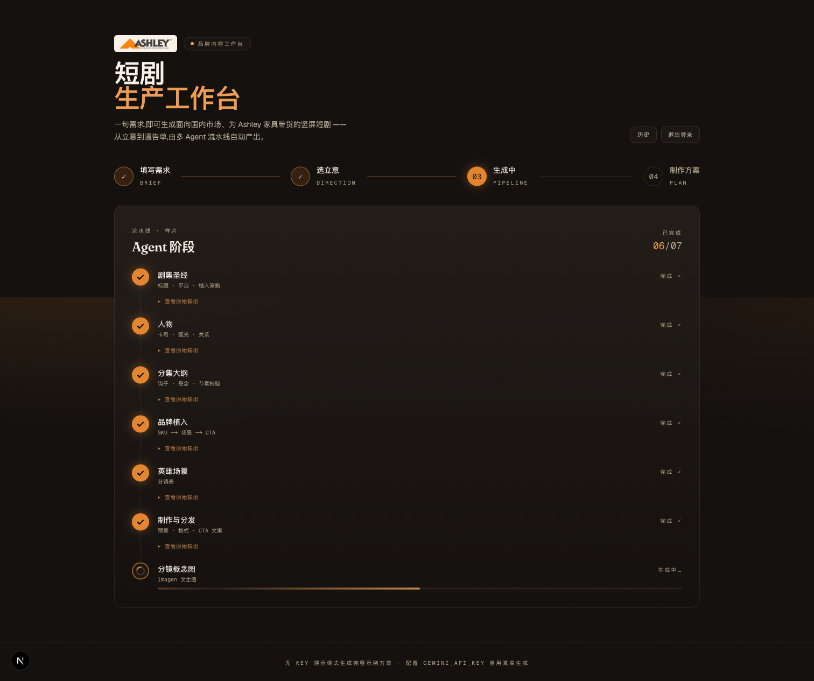
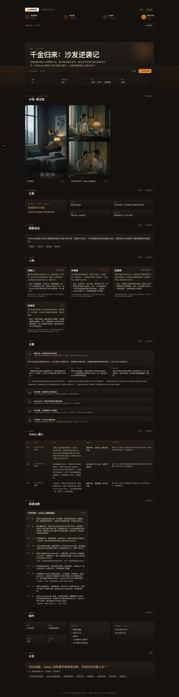
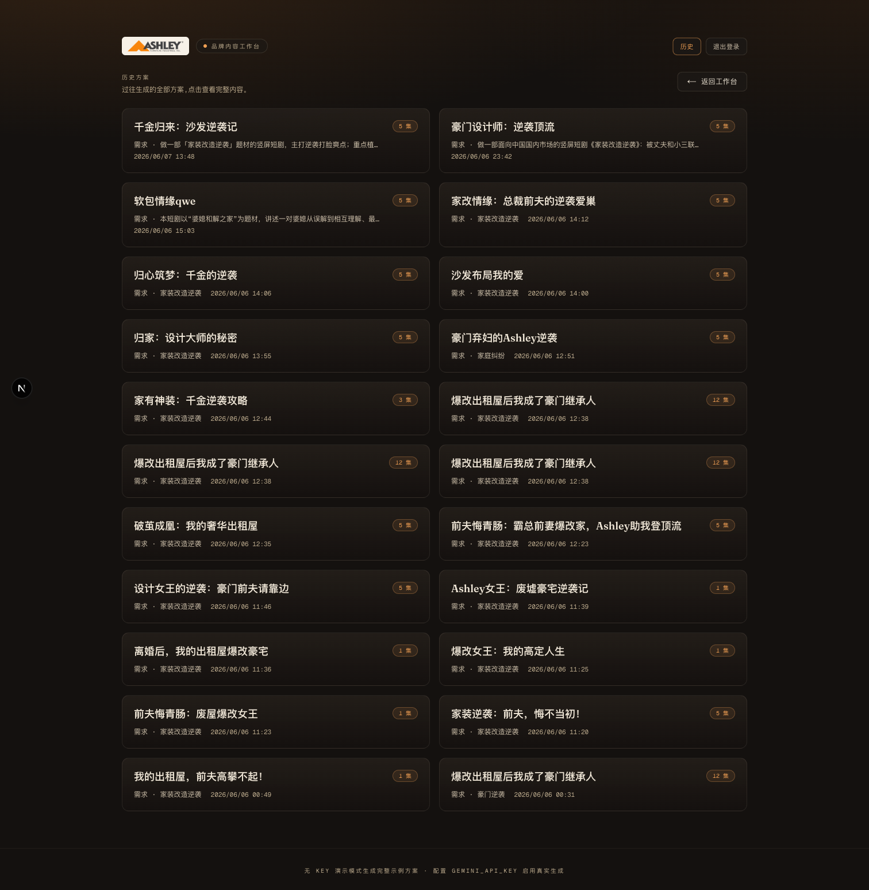
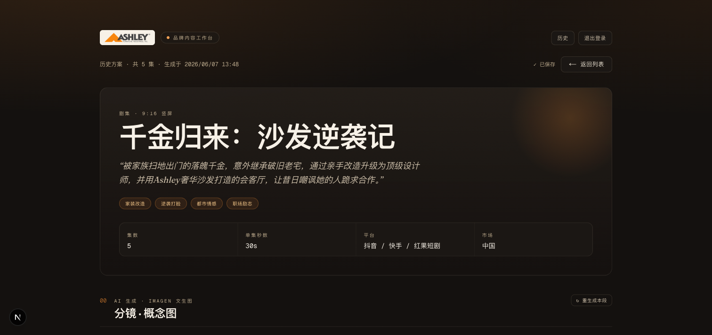
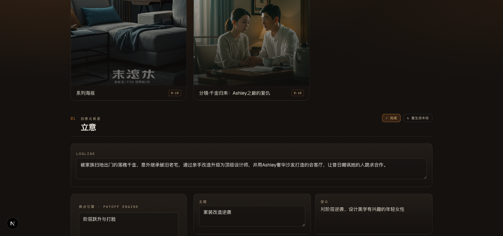

# 短剧生产工作台 · 产品使用指南

**一句话需求,就能生成一份可直接开拍的竖屏短剧方案。**

你只要用一段话说清"想拍什么样的短剧、主打什么爽点、想带货哪些 Ashley(爱室丽)家具",系统就会自动产出一份结构完整的**中文短剧制作方案**——面向抖音 / 快手 / 红果短剧(竖屏 9:16),把剧情自然变成 Ashley 家具的带货内容。

它能帮你:

- 把一句想法,**几分钟**变成一份从立意、人物、分集到品牌植入、分镜、通告单的完整方案;
- 一次给出**多个立意方向**任你挑选;
- 每个部分都能**就地修改或一键重写**,直到满意;
- 自动配上**短剧海报 / 关键场景概念图**;
- 一键导出,直接发给编剧 / 剧组。

---

## 开始使用:登录

打开工作台,用账号登录(默认 **admin / admin**)即可进入。

---

## 两种用法,任你切换

登录后,右上角可以在 **「对话」** 和 **「向导」** 两种模式间随时切换,两者共用同一套生成能力,产出的方案完全一样:

- **对话式 agent(默认)** —— 像聊天一样,一句话说清想拍什么,AI 就边想边干、实时把方案"长"出来;之后还能继续对话局部修改。最快、最自然,推荐先用这个。
- **向导四步** —— 把生成过程拆成「填需求 → 选立意 → 生成 → 方案」四步,每一步都看得见、可干预。想精挑立意、逐项把控时用它。

---

## 模式一 · 对话式 agent(默认,推荐)

进入工作台默认就是这个模式。界面分两栏:**左边是对话**,**右边是实时生长的方案画布**。

在左侧输入框里用**一段话**说清你想拍的短剧(题材 / 套路、主打爽点、想植入的 Ashley 家具、集数与时长),按 **Enter** 发送。例如:

> 做一部「家装改造逆袭」题材的竖屏短剧,主打逆袭打脸爽点,重点植入 Ashley 客厅沙发和卧室套装,5 集、每集 30 秒。

发出后,AI 会像一位编剧助理那样**当着你的面一步步干活**,左栏实时滚动出它的:

- **💭 思考** —— 它接下来打算做什么、为什么这么定;
- **🔧 工具调用** —— 查爆款套路库、生成立意、写剧集圣经、写人物、生成分集、**节奏校验**、查 Ashley SKU 目录、排布品牌植入、设计英雄场景、制作与分发、生成概念图……每完成一步都打钩 ✓;
- 每完成一块,右侧画布对应板块就**实时点亮并填好内容**,顶部进度从 `00/08` 一路走到 `08/08`。

跑完后右侧就是一份和向导模式同样完整的 **8 板块方案**,可直接 **导出 JSON / Markdown**,也能对任意板块点「✎ 编辑」或「↻ 重生成本段」。

> **想改哪里,直接继续说就行。** 比如「把基调改轻松一点」「第 3 集的钩子再炸一点」「多植入一件餐桌」,AI 会只改对应板块,右侧画布随之更新——不用整篇重来。

---

## 模式二 · 向导四步

想一步步把控生成过程,就切到右上角的 **「向导」**,按四步走。

### 第 1 步 · 填写需求

用**一段话**写清:题材 / 套路、主打爽点、想植入的 Ashley 家具,再设定集数和单集时长。

不知道怎么写?用页面里的**提示词助手**:

- 点「套用模板」一键填好骨架;
- 点下面的标签(题材套路 / 爽点引擎 / Ashley 植入)往需求里追加;
- 或点「✨ AI 扩写 / 优化」,把粗略想法自动补全成完整需求。

还能**选参考图**(预设家居图或自己上传,最多 3 张),让生成的画面风格、家具质感更贴近你的想法。

填好后点 **「生成方案」**。

### 第 2 步 · 选立意

系统会围绕你的需求,给出 **3 个明显不同的方向**(不同的故事梗概、爽点、基调、核心冲突)。挑一个你最喜欢的;不完全满意的话,可以在下方**直接改**它的关键字段,再点 **「确认并生成」**。

### 第 3 步 · 生成中

接下来系统会按你选的方向,**一步步自动产出**整份方案,进度实时显示——立意、剧集设定、人物、分集、品牌植入、重点分镜、制作与分发、概念图,逐项完成打钩。稍等片刻即可。

### 第 4 步 · 拿到方案

得到一份 **8 个板块**、可直接交付的完整方案:

| 板块 | 内容 |
|---|---|
| 概念图 | AI 生成的竖屏系列海报 + 关键场景概念图 |
| 立意 | 一句话梗概、主题、目标观众、基调、核心爽点、核心冲突 |
| 剧集设定 | 剧名、题材标签、集数 / 时长、投放平台、品牌植入主线 |
| 人物 | 主角 / 反派 / 感情线等人物小传与成长弧光 |
| 分集 | 每集梗概、节拍、黄金 3 秒开场钩子、结尾悬念、爽点 |
| Ashley 植入 | 哪一集、哪个场景、植入哪件家具、踩在哪个情绪点、何时弹购买引导 |
| 重点分镜 | 高潮剧集的逐镜头脚本 + 台词 |
| 制作 | 画幅、预算档、镜头数、卡司、场景、家具道具清单 |
| 分发 | 带货文案、挂链位置、话题标签 |

在这一页你可以:

- 对**任意板块**点「✎ 编辑」就地改文字,或点「↻ 重生成本段」让 AI 只重写这一段(还能附一句要求,比如"基调更轻松一点");
- 一键导出 **JSON / Markdown**,发给团队;
- 点「＋ 新方案」从头再来。

每份生成的方案都会**自动存进历史**,随时回看。

---

## 历史方案:随时回看与打磨

点右上角「历史」,能看到你生成过的全部方案。

每张卡片显示剧名、集数、需求摘要和时间;鼠标移上去可**删除**。点卡片进入详情。

进入详情后,和方案页一样,每个板块都能**单独编辑或重写**。最方便的是:

> **改完点「✓ 完成」,自动存回**——右上角会从「保存中…」变成「✓ 已保存」,不用手动点保存。「重生成本段」跑完也会自动存好。

点某个板块的「✎ 编辑」,只有这个板块的文字会变成可填写状态,其它板块不受影响;改完点「✓ 完成」即自动保存。

---

## 几个小贴士

- 第一次用,直接用**对话模式**说一句话最省事;想精挑立意再切到「向导」。
- 对话里想改哪块,**直接跟 AI 说**(如"基调更轻松""第 3 集钩子再炸点"),它只改那一块。
- 哪一段不满意,**不用整篇重来**——对那一段点「重生成本段」,还能附一句具体要求。
- 想要更贴合的画面风格,第 1 步多传一两张**参考图**。
- 拿不准怎么描述需求,先点「✨ AI 扩写」,再在它的基础上改。
- 所有改动在历史里**点「完成」就自动留底**,随时回来继续打磨。
